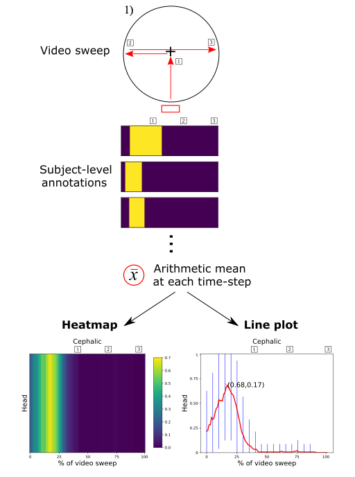

# Statistical characterisation of fetal anatomy in simple obstetric ultrasound video sweeps

Repository for statistical characterisation of fetal anatomy in simple obstetric ultrasound video sweeps (DOI:). Parameters describing statistical heatmaps using video sweeps of the CALOPUS protocol (https://doi.org/10.2196/37374) are provided and made freely available. Parameters exist for fetal presentations: breech, cephalic, transverse and fetal anatomies: head, spine, abdomen, pelvis, femur using 760 unique frame-level manual annotations from 365 unique pregnancies. See publication for more details.



Two pickle files encode probabilities (probabilities.pkl) and standard deviations (stds.pkl) with the following tree structure:

```
├───A
│   ├───breech
│   │   ├───abdomen
│   │   ├───femur
│   │   ├───head
│   │   ├───pelvis
│   │   └───spine
│   ├───cephalic
│   │   ├───abdomen
│   │   ├───femur
│   │   ├───head
│   │   ├───pelvis
│   │   └───spine
│   └───other
│       ├───abdomen
│       ├───femur
│       ├───head
│       ├───pelvis
│       └───spine
├───B
│   etc ...
```

Step 1 = A \
Step 2 = B \
Step 3 = C \
Step 4 = D \
Step 5 = E \
Following notation given in publication.

**Requirements:** \
numpy \
pickle \
matplotlib

Sample command:
```
python statistical_heatmaps.py
```
Two visualisations should be generated: 1) 1-D detection-based heatmap 2) 2-D line plot with standard deviations as error bars every 5th position identical to those shown on the figure above.
